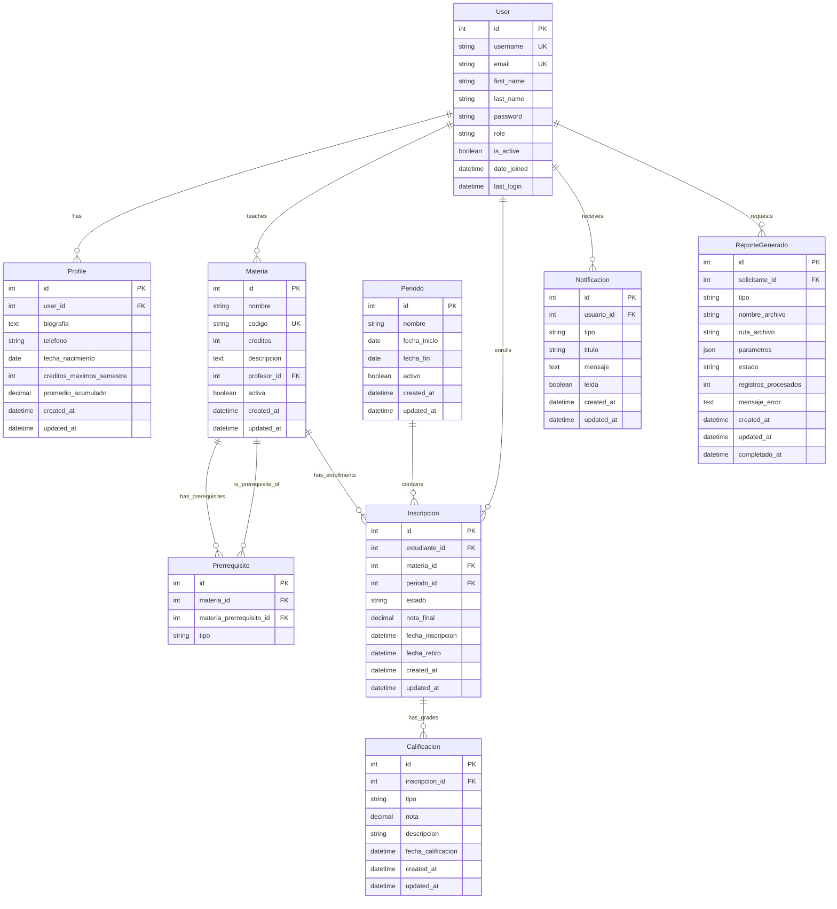

# Esquema de Base de Datos (ERD)

Este diagrama muestra la estructura completa de la base de datos del sistema académico, incluyendo todas las entidades y sus relaciones.

## Descripción de Entidades

### User
Modelo de usuario personalizado que extiende el User de Django.
- **Roles**: admin, profesor, estudiante
- **Campos clave**: username (único), email (único), role

### Profile
Perfil extendido para cada usuario con información adicional.
- **Relación**: OneToOne con User
- **Información académica**: créditos máximos, promedio acumulado

### Materia
Representa las materias/asignaturas del sistema.
- **Profesor**: ForeignKey a User (role='profesor')
- **Campos**: nombre, código único, créditos, descripción

### Prerrequisito
Relación many-to-many entre materias para definir prerrequisitos.
- **Tipos**: obligatorio, recomendado
- **Validación**: Automática en inscripciones

### Periodo
Períodos académicos (semestres).
- **Estado**: Solo uno puede estar activo
- **Inscripciones**: Vinculadas a períodos específicos

### Inscripcion
Relación estudiante-materia en un período específico.
- **Estados**: activa, aprobada, reprobada, retirada, cancelada
- **Validaciones**: Prerrequisitos, límites de créditos

### Calificacion
Calificaciones detalladas de las inscripciones.
- **Tipos**: parcial, final, quiz, taller
- **Rango**: 0.0 - 5.0 (aprobación >= 3.0)

### Notificacion
Sistema de notificaciones para usuarios.
- **Tipos**: bienvenida, inscripcion, calificacion, recordatorio
- **Estado**: leída/no leída

### ReporteGenerado
Registro de reportes CSV generados en el sistema.
- **Estados**: pendiente, generando, completado, error
- **Tipos**: estudiante, profesor, materia, general 