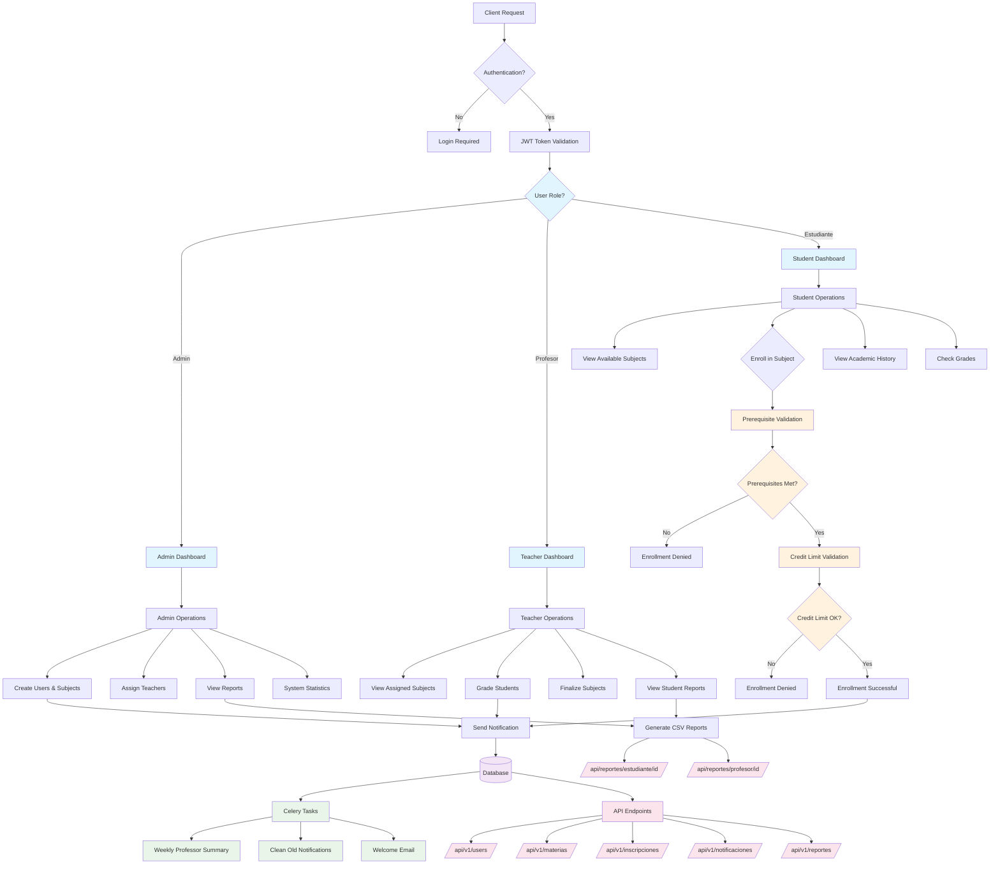

# Diagrama de Flujo del Proyecto

Este diagrama muestra el flujo completo del sistema académico, desde la autenticación hasta las operaciones específicas por rol.

## Descripción del Flujo

### 1. Autenticación y Autorización
- **Client Request**: Toda solicitud pasa por validación
- **JWT Token Validation**: Tokens de acceso y refresh
- **Role-based Routing**: Redirección según rol del usuario

### 2. Dashboards por Rol

#### Administrador
- **Create Users & Subjects**: Gestión completa del sistema
- **Assign Teachers**: Asignación de profesores a materias
- **View Reports**: Acceso a todos los reportes del sistema
- **System Statistics**: Métricas y estadísticas generales

#### Profesor
- **View Assigned Subjects**: Materias asignadas al profesor
- **Grade Students**: Calificación de estudiantes inscritos
- **Finalize Subjects**: Finalización de materias cuando todos están calificados
- **View Student Reports**: Reportes de estudiantes de sus materias

#### Estudiante
- **View Available Subjects**: Materias disponibles para inscripción
- **Enroll in Subject**: Proceso de inscripción con validaciones
- **View Academic History**: Histórico académico completo
- **Check Grades**: Consulta de calificaciones

### 3. Validaciones de Inscripción

#### Prerequisite Validation
- Verificación automática de prerrequisitos
- Validación de materias aprobadas (nota >= 3.0)
- Decorador `@validate_prerequisites`

#### Credit Limit Validation
- Verificación de límites de créditos por semestre
- Prevención de sobrecarga académica
- Decorador `@validate_credit_limits`

### 4. Sistema de Notificaciones
- **Bienvenida**: Al crear nuevo usuario
- **Inscripción**: Confirmación de inscripciones
- **Calificaciones**: Notificación de nuevas notas
- **Signals**: Automáticas usando Django signals

### 5. Tareas Asíncronas (Celery)
- **Weekly Professor Summary**: Resumen semanal a profesores
- **Clean Old Notifications**: Limpieza de notificaciones antiguas
- **Welcome Email**: Emails de bienvenida a nuevos usuarios

### 6. Generación de Reportes
- **CSV Reports**: Reportes directos en formato CSV
- **Student Reports**: `/api/reportes/estudiante/{id}/`
- **Professor Reports**: `/api/reportes/profesor/{id}/`
- **Content**: Nombre, materias, calificaciones, estado, promedio

### 7. API Endpoints
- **Users**: Gestión de usuarios y autenticación
- **Materias**: Materias, prerrequisitos y períodos
- **Inscripciones**: Inscripciones y calificaciones
- **Notificaciones**: Sistema de notificaciones
- **Reportes**: Generación y descarga de reportes

## Características Técnicas

### Middleware Personalizado
- **RoleMiddleware**: Control de acceso basado en roles
- **SecurityMiddleware**: Headers de seguridad

### Optimizaciones ORM
- **select_related**: Para relaciones ForeignKey
- **prefetch_related**: Para relaciones ManyToMany
- **annotate**: Para cálculos agregados

### Seguridad
- **JWT Authentication**: Tokens seguros
- **Role-based Permissions**: Permisos por rol
- **Data Validation**: Validaciones en modelos y serializers
- **Sensitive Data Protection**: No exposición de datos sensibles 